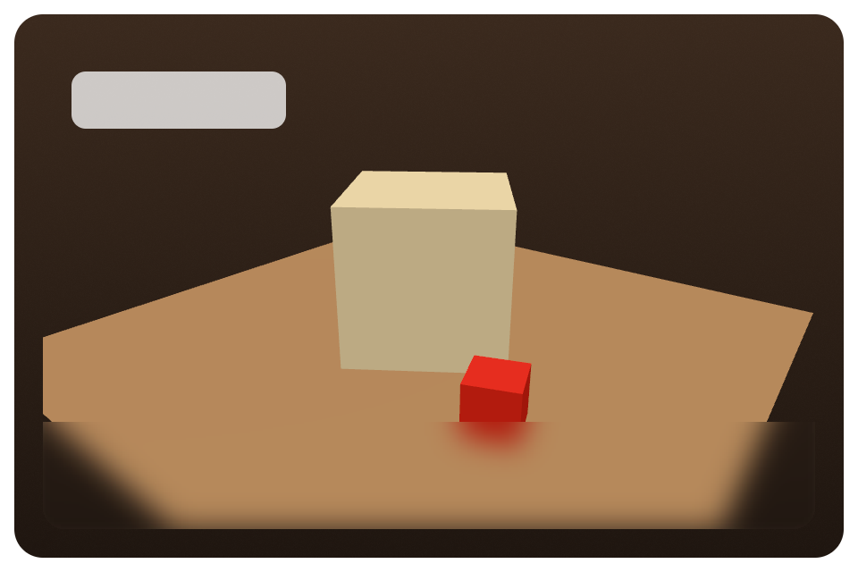

# 3D in zpui: research findings and design

Status: research + design + Vulkan spike, 2026-10-05. Nothing here has been merged into or pushed to zpui.

Question: can the Carcassonne desktop app (built on [zpui](https://github.com/plyght/zpui))
get a "realistic tabletop that comes to life" look (PBR wooden table, cardboard tiles, wooden
meeples, animated diorama pieces) from 3D code that already exists in zui or gpui, or do we
have to build a 3D pipeline ourselves?

**Short answer.** No. zui, upstream gpui and the gpui community have no 3D renderer, no depth
buffer, no projection matrices and no mesh pipeline. The closest thing upstream is
"composite an externally rendered GPU texture" (macOS `CVPixelBuffer` surfaces, plus an
unmerged wgpu external-compositor proposal). None of it is worth porting. What *is* worth
copying is the pattern: render 3D offscreen and composite the result as a primitive in draw
order. zpui already does exactly this internally for vector paths, so a 3D pass fits cleanly.
The recommendation is a native `Scene3D` subsystem in zpui (Vulkan + Metal), rendered
offscreen in HDR with MSAA and depth, then tonemapped and composited by a new `viewport3d`
scene primitive. The fallback is Three.js in a WKWebView on macOS, which is a weak fallback on
Linux.

Sources checked (shallow clones, read-only):

| Repo | Commit | Local path |
|---|---|---|
| zpui (plyght/zpui) | `066bd86` (2026-10-05) | `/home/user/plyght/zpui` |
| zui (zeronsh/zui) | `0966d06` (2026-10-03) | `/home/user/research/zui` |
| zed (gpui crates only, sparse) | `eec3376` (2026-10-05) | `/home/user/research/zed` |

---

## (a) Does zui or gpui have usable 3D?

### zui: no

zui is "Zeron's fork of GPUI ... extracted into a standalone workspace" (`README.md`). It
is upstream `f14fea9` plus the comet patches (EdgeFade, BackdropBlur, wgpu frosted glass,
`ImageSource::evict`, and so on). None of those patches touch 3D.

I searched all of `crates/` for `depth_stencil`, `DepthStencil`, `perspective`, `projection`,
`Mat4`/`mat4x4` and custom-shader hooks:

- `crates/gpui_wgpu/src/wgpu_renderer.rs:881` sets `depth_stencil: None` on every pipeline.
  Lines 1264, 1438, 1462 and 1868 set `depth_stencil_attachment: None` on every pass.
- `crates/gpui_macos/src/metal_renderer.rs` has no depth attachment or depth state.
- The only `mat4x4` is `ycbcr_to_RGB` in `crates/gpui_wgpu/src/shaders.wgsl:1453`, a
  video color matrix.
- The only "surface" is `crates/gpui/src/elements/surface.rs`, which works on macOS only and
  wraps a `CVPixelBuffer`. `crates/gpui/src/scene.rs:954` defines `PaintSurface`.
  `crates/gpui_macos/src/metal_renderer.rs:~2000` has `draw_surfaces`, which asserts
  `kCVPixelFormatType_420YpCbCr8BiPlanarFullRange` (bi-planar video) and samples Y/CbCr
  through `CVMetalTextureCache`. It exists for screen sharing and video, not 3D. The wgpu
  backend has `vs_surface`/`fs_surface` shaders but no caller on Linux.
- Neither crate exposes a user shader hook. `canvas()` only paints gpui's own 2D primitives.

### Upstream gpui (zed `crates/gpui*`): no

Upstream has the same structure. `crates/gpui/src/elements/` contains `surface.rs` (the same
CVPixelBuffer element) and no 3D element. `crates/gpui/examples/` has no 3D example. Upstream
replaced blade with wgpu on Linux in
[#46758](https://git.secluded.site/zed/commit/af8ea0d6c26192c45f44f473c0d4a7d6f72ed018), so
blade is gone and there is nothing 3D to inherit from it. The Zed "videogame" blog post
([zed.dev/blog/videogame](https://zed.dev/blog/videogame)) describes one shader per 2D
primitive; its "3D camera" remark refers to a debug visualization, not shipped code.

### Ecosystem: only "composite someone else's texture"

| Effort | What it is | Useful to us? |
|---|---|---|
| [zed discussion #54236](https://github.com/zed-industries/zed/discussions/54236) "render from RGBA texture directly?" | Maintainer answer: there is no texture import. Use `img()` with `ImageSource::Custom` (CPU upload each frame, BGRA), or `surface()` on macOS. | Confirms the gap. |
| [zed issue #60572](https://github.com/zed-industries/zed/issues/60572) / [PR #60573](https://github.com/zed-industries/zed/pull/60573) "external compositor" | Zero-copy composition of externally rendered **wgpu** textures (`ExternalCompositorRegistry`, `ExternalCompositorPrimitive`, `WgpuExternalCompositor` trait). The fork lives at `0xCarbon/zed#feat/external-compositor` (for CAD viewports), with a macOS/Windows experiment in `MSIsunny/zed`. The PR was **closed** by the maintainer pending design discussion. It has no depth buffer and no 3D; the external app brings its own renderer. | Validates the "offscreen + composite primitive" architecture. No code worth porting (Rust/wgpu). |
| [zed discussion #64849](https://github.com/zed-industries/zed/discussions/64849) | Proposes extending `PaintSurface` to more CVPixelBuffer formats and D3D11 SRVs. | Same pattern; not 3D. |
| [longbridge/gpui-kit discussion #2594](https://github.com/longbridge/gpui-kit/discussions/2594) "GPUI for a game engine?" | Lists the options: CPU readback into `img()` (prototype only), a texture-import fork, a separate native window, or embedding gpui inside the engine. Mentions a Bevy↔GPUI zero-copy viewport write-up (tridentforu.com, "Building a Production-Grade 3D Viewport", 2025-10) and a "WGPUI" fork. | Every option uses Bevy or wgpu as the 3D renderer. Nothing native to gpui. |
| [gpui-wgpu / gpui-ce](https://deepwiki.com/mdeand/gpui-wgpu) | Community fork that runs every platform on wgpu. | Still 2D only. |

Conclusion: no 3D code exists in the gpui family to port to Zig. The only reusable idea is
an architectural one, described in (b).

---

## (b) What can be ported or reused

1. **The composite-in-draw-order pattern.** gpui's `PaintSurface` and the external-compositor
   proposal both insert a textured rect into the scene's ordered primitive stream. zpui
   already has a `surface` kind (`src/scene.zig:310 PaintSurface`, `PrimitiveKind.surface`).
   On Vulkan it is a stub: `Renderer.zig:881` logs "surfaces are not supported by the Vulkan
   renderer yet". So the batching and ordering plumbing for an "externally rendered rect"
   already exists. We add a sibling kind, or generalize this one.
2. **zpui's own path pipeline, used as a template.** `Recorder.drawPaths`
   (`src/renderer/vulkan/Renderer.zig:~893`) and `drawPathsToIntermediate`/`FromIntermediate`
   (`src/renderer/metal/renderer.zig:920–1000`) already do these steps: end the main pass,
   render into a 4× MSAA intermediate with resolve, resume the main pass with `LOAD`, and
   composite with a premultiplied sprite pipeline. A 3D viewport is the same shape plus a
   depth attachment and an HDR format.
3. **Resource-sync pattern from `Atlas`** (`src/atlas.zig`). The CPU-side store owns no GPU
   objects. Each frame the backend reconciles `generation`s and drains `pendingUploads()`.
   Meshes, textures and materials for 3D should follow the same contract, so the element and
   app code stay backend-agnostic.
4. **Golden-image harness**: `examples/render_test.zig` plus `tests/golden/*.png`, with
   per-backend goldens, `channel_tolerance = 4` and `max_diff_fraction = 0.002`. CI's
   `render` job runs it on lavapipe (`VK_ICD_FILENAMES=.../lvp_icd.json`) and on
   `macos-15-intel` for Metal.
5. **External Zig/C libraries** to reuse instead of writing our own:
   [cgltf](https://github.com/jkuhlmann/cgltf) (single-header C, MIT) or
   [zgltf](https://github.com/kooparse/zgltf) (pure Zig). `stb_image.h` is already in
   `vendor/stb` for PNG/JPEG base-color textures. For math, a small in-tree `math3d.zig`
   (Vec3/Vec4/Mat4/Quat, about 400 lines) avoids a dependency; zmath is an alternative if
   SIMD matters.

---

## (c) Recommended architecture for zpui 3D

### Facts about zpui that constrain the design

- The backend is chosen at comptime (`src/renderer/renderer.zig`): Metal on Darwin, Vulkan
  elsewhere. Both expose `init/deinit/atlas/drawScene/readPixels/resize`.
- **Vulkan** (`src/renderer/vulkan/`) targets 1.3 with **dynamic rendering**
  (`vkCmdBeginRendering`, `VkPipelineRenderingCreateInfo`). Instance data is pulled through
  **buffer device address** in push constants (`PushConstants.instances`). There is no
  vertex-input state; all pipelines share one `pipeline_layout` and one combined-sampler
  descriptor set. Two frames in flight. The swapchain or offscreen color is
  `B8G8R8A8_UNORM`/`R8G8B8A8_UNORM` (**not sRGB**). UI blends in gamma space with
  premultiplied output.
- **Vulkan shaders**: GLSL in `src/renderer/vulkan/shaders/*.vert|frag`. `build.zig`
  (`addVulkanRenderer`) runs `glslc --target-env=vulkan1.3 -O` on each and embeds the SPIR-V
  through a generated `vulkan_shaders` module.
- **Metal** (`src/renderer/metal/`): one hand-written `shaders.metal`, `@embedFile`d and
  compiled **at runtime** with `newLibraryWithSource`. There is no offline metallib, so the
  build needs no Xcode toolchain and `metal-check` cross-compiles from Linux. Three frames in
  flight. Bindings are hand-rolled in `src/platform/mac/metal.zig`. It has no depth-stencil
  state API yet: no `MTLDepthStencilDescriptor`, no `depth32Float` in `PixelFormat`.
- **Shader convention: hand-written pairs.** GLSL for Vulkan and MSL for Metal, kept in sync
  by hand against `docs/shaders-notes.md`.
- **Frame loop**: elements `requestLayout → prepaint → paint` into a `Scene`.
  `scene.finish()` sorts by draw order. The platform presenter calls
  `renderer.drawScene(scene, …)`. Continuous animation uses
  `window.requestAnimationFrame()` (`src/window/window.zig:1091`). `canvas()`
  (`src/elements/canvas.zig`) is the escape hatch for custom painting.
- **Native views** (`src/platform/mac/native_views.zig`): on macOS, NSViews such as WKWebView
  are layered between the main CAMetalLayer and an overlay plane. On Linux, zeron's browser
  is a WebKitGTK **helper process piping rendered pixels**
  (`apps/zeron/native/linux-browser/helper.c`). It is not a real embedded GPU view.

### Decision: offscreen 3D target composited in draw order (not in-pass)

Each `Scene3D` viewport renders into its own offscreen targets:

```
per viewport, per frame (only when dirty):
  [shadow pass]  D32F shadow map (2048², one directional light)
  [main pass]    RGBA16F color (4× MSAA) + D32F depth (4× MSAA, transient)
                 → resolve to RGBA16F (1×)
  [post]         optional: bloom-lite / SSAO later
main UI pass (unchanged), at the viewport's draw order:
  [composite]    sample resolved HDR → exposure + ACES/Khronos-PBR-Neutral tonemap
                 → sRGB OETF → premultiply → rounded-corner SDF + content-mask clip
```

Why offscreen rather than drawing meshes into the UI pass with a depth attachment:

- The UI pass has no depth buffer, is 1× sampled (paths use their own MSAA intermediate), and
  is gamma-space UNORM. Adding depth and MSAA to every UI pass costs memory and bandwidth for
  every window, including windows with no 3D.
- PBR lighting must be done in linear HDR and then tonemapped. The UI must stay in gamma
  space to match zui pixel for pixel, which the existing goldens enforce. A separate target
  keeps both correct.
- The 3D view becomes an ordinary 2D citizen. UI below it (table chrome) and above it (score
  HUD, tooltips, frosted menus with `BackdropBlur`) composite correctly by draw order, and
  rounded corners and clipping come for free.
- **Pre-pass ordering.** 3D targets do not depend on 2D content, so the backend renders all
  dirty viewports *before* `beginMain`, then composites inside the main pass. This avoids the
  end-pass/resume cost that `drawPaths` pays, which matters for tile-based Apple GPUs.
- **Caching.** A board game is static most of the time. When nothing in the 3D scene changed
  (no animation, camera at rest), the backend skips the 3D passes and only re-composites the
  cached resolve texture. That saves battery on laptops.

### New scene primitive

```zig
// src/scene.zig
pub const Viewport3D = extern struct {
    order: DrawOrder = 0,
    bounds: Bounds,                // device px
    content_mask: ContentMask,
    corner_radii: Corners,
    scene_id: u32,                 // index into renderer's Scene3D registry
    target_generation: u32,        // backend re-renders when != cached
    exposure: f32,
    pad: u32 = 0,
};
pub const PrimitiveKind = enum(u8) { ..., surface, viewport3d };
```

`BatchIterator` already handles any kind generically. The new kind gets a `viewports3d` list.
On Metal, `drawLayered` must route it to the main plane only, or to the overlay plane if it is
ever placed above a native view.

### Zig API surface (new module `src/three/`, exported as `zpui.three`)

```zig
pub const Gfx3D = struct {            // backend-agnostic store, like Atlas; one per window/renderer
    pub fn createMesh(self, desc: MeshDesc) !MeshId;           // queues upload
    pub fn createTexture(self, desc: TextureDesc) !TextureId;  // RGBA8 sRGB / RGBA8 linear / BC7 later
    pub fn createMaterial(self, m: Material) !MaterialId;
    pub fn destroy(self, handle: anytype) void;                // deferred by frames-in-flight
    pub fn createScene(self) !*Scene3D;
};

pub const Vertex = extern struct {          // 48 B, pulled via BDA / Metal buffer
    pos: [3]f32, normal: [3]f32, uv: [2]f32, tangent: [4]f32,
};
pub const MeshDesc = struct {
    vertices: []const Vertex, indices: []const u32,
    submeshes: []const Submesh,                   // index ranges + MaterialId
    bounds: Aabb,                                  // for culling + picking
};

pub const Material = extern struct {        // glTF 2.0 metallic-roughness
    base_color_factor: [4]f32 = .{1,1,1,1},
    emissive_factor: [3]f32 = .{0,0,0},
    metallic: f32 = 0, roughness: f32 = 0.8, normal_scale: f32 = 1, occlusion_strength: f32 = 1,
    alpha_mode: AlphaMode = .opaque, alpha_cutoff: f32 = 0.5,
    base_color_tex: TextureId = .none, metallic_roughness_tex: TextureId = .none,
    normal_tex: TextureId = .none, occlusion_tex: TextureId = .none, emissive_tex: TextureId = .none,
};

pub const Camera = struct {
    eye: Vec3, target: Vec3, up: Vec3 = .{0,1,0},
    projection: union(enum) { perspective: struct { fov_y: f32, near: f32, far: f32 },
                              orthographic: struct { height: f32, near: f32, far: f32 } },
    pub fn viewProj(self, aspect: f32) Mat4;     // reverse-Z, Vulkan/Metal clip space (0..1 depth)
    pub fn ray(self, viewport: Bounds, p: Point) Ray;  // for picking
};

pub const Light = union(enum) {
    directional: struct { dir: Vec3, color: Vec3, intensity: f32, cast_shadows: bool = true },
    point: struct { pos: Vec3, color: Vec3, intensity: f32, range: f32 },   // candles, fire
};
pub const Environment = struct {
    ambient_sh: [9][3]f32,          // irradiance as SH9 (precomputed offline from an HDRI)
    specular: TextureId = .none,    // prefiltered cubemap (phase 3); fallback: flat ambient
    exposure: f32 = 1,
};

pub const Scene3D = struct {
    camera: Camera, lights: BoundedArray(Light, 8), env: Environment,
    pub fn clear(self) void;                                    // per-frame draw list
    pub fn draw(self, mesh: MeshId, transform: Mat4, opts: DrawOpts) void;   // DrawOpts: tint, material override, pick id
    pub fn drawInstanced(self, mesh: MeshId, transforms: []const Mat4, opts: DrawOpts) void;
    pub fn particles(self, emitter: ParticleBatch) void;       // phase 4: smoke, sparkles (billboards)
    pub fn pick(self, viewport: Bounds, p: Point) ?PickHit;    // CPU raycast over draw list AABBs/triangles
};

// element
pub fn viewport3d(scene: *Scene3D) Canvas;   // styled box; paint → window.paintViewport3D(bounds, scene)
```

Element integration: `viewport3d(scene)` is a thin `canvas` wrapper, like `nativeView`. Its
paint calls `window.paintViewport3D(bounds, scene)`, which snaps bounds, records the content
mask and corner radii, and inserts a `Viewport3D` primitive. The app fills the `Scene3D` draw
list in `render()` or in an animation callback, and calls `window.requestAnimationFrame()`
while anything is animating. The renderer reaches `Gfx3D` through the platform vtable, the
same way it reaches `atlas()` today (`src/platform/mac/window.zig:793`,
`src/platform/linux/presenter.zig:44`).

### Backend work

**Shared CPU side (`src/three/`)**: math, `Gfx3D` store (generations, pending uploads,
deferred frees), the draw-list sort (opaque front-to-back by material, then alpha-blended
back-to-front), frustum culling, the glTF loader, and picking. All of it is unit-testable
without a GPU.

**Vulkan** (`src/renderer/vulkan/three.zig`, called from `Renderer.drawScene`):

- Images: `R16G16B16A16_SFLOAT` color (MSAA 4× when `framebufferColorSampleCounts` allows;
  lavapipe supports 4×), `D32_SFLOAT` depth (mandatory format, works on lavapipe), plus a
  1× resolve image. All are per viewport, resized with the bounds. Depth uses
  `TRANSIENT_ATTACHMENT` where possible. Shadow map: `D32_SFLOAT` 2048².
- Pipelines: keep the existing **BDA vertex pulling** convention (no vertex-input state). A
  new pipeline layout has push constants `{ u64 vertices; u64 instances; u64 frame_ubo;
  u32 material; … }` (≤128 B) and one descriptor set with a bindless-ish array of sampled
  images (`descriptorIndexing` is core in 1.2 and supported by lavapipe). Three pipelines:
  `mesh_depth` (shadow), `mesh_pbr` (opaque, depth test GREATER with reverse-Z),
  `mesh_pbr_blend` (alpha). A `VkPipelineRenderingCreateInfo` with
  `depthAttachmentFormat = D32_SFLOAT`. Each pipeline is created with the correct
  `rasterizationSamples` and `cullMode = BACK`.
- Composite: a `viewport3d` pipeline in the main pass (premultiplied blend, unit quad, the
  same clip/SDF helpers as `poly_sprite`).
- Uploads go through the existing staging buffer and `recordUploads`. Meshes are device-local
  buffers with `SHADER_DEVICE_ADDRESS`.

**Metal** (`src/renderer/metal/three.zig` and `three.metal`):

- Extend `metal.zig` with `MTLDepthStencilDescriptor`/`newDepthStencilState`,
  `setDepthStencilState`, the `depth32Float` and `rgba16Float` formats, depth attachments on
  `RenderPassDescriptor`, `setDepthAttachmentPixelFormat` on the pipeline descriptor,
  `drawIndexedPrimitives`, `setCullMode`/`setFrontFacingWinding`, and sampler states.
  Mostly 1-line `objc.msgSend` wrappers.
- The depth texture uses `storageMode = memoryless` on Apple Silicon (no bandwidth) and
  `private` on Intel CI.
- Same passes as Vulkan. The composite runs in the main encoder at the primitive's order.

### Shaders: one source, generated MSL checked in

The 2D renderer's hand-written pairs work because each 2D shader is small and frozen to zui.
PBR + shadows + tonemap is about 600–900 lines and will keep changing. Recommended approach:

- Write 3D shaders **once in GLSL 4.60** (`src/renderer/three/shaders/*.vert|frag`), which
  matches the existing `glslc` toolchain and CI deps.
- `build.zig`: `glslc` → SPIR-V for Vulkan, as today.
- A new `zig build gen-msl` step runs `spirv-cross --msl --msl-version 20100
  --msl-argument-buffers` (Linux CI apt package `spirv-cross`) and writes
  `src/renderer/metal/three_gen.metal`, which is **committed**. The Metal backend
  `@embedFile`s it and compiles it at runtime, exactly like `shaders.metal`. macOS builds then
  still need no extra toolchain, and `metal-check` keeps cross-compiling. A Linux CI job runs
  `gen-msl` and fails on `git diff --exit-code`, so the generated file cannot drift.
- Binding layout must survive SPIRV-Cross. Use explicit `layout(set=0, binding=N)` and keep
  push constants ≤ 4 KB, since SPIRV-Cross maps them to a `constant` buffer slot. BDA
  (`GL_EXT_buffer_reference`) translates to MSL `device T*` pointers. The spike verified this
  for `mesh.vert/frag` and `viewport3d.frag`; see the spike section. Fallback if it
  misbehaves: plain SSBOs (`readonly buffer`) on both backends.
- Alternative: Slang compiles natively to both SPIR-V and MSL. It is a heavier dependency
  (about 100 MB binary) and not in CI today. Revisit only if GLSL→MSL becomes painful.
- For the spike only, a hand-written GLSL/MSL pair is fine (about 150 lines each).

### Lighting and look ("tabletop that comes to life")

- **PBR**: glTF metallic-roughness BRDF (GGX + Smith + Schlick, Lambert diffuse), normal maps
  with MikkTSpace tangents from the glTF, and occlusion textures. Wood, cardboard and painted
  meeples are all dielectric (metallic≈0), so most of the look comes from roughness and
  normal maps plus good lighting.
- **Lights**: one key directional "window light" with a **shadow map** (PCF 5×5 or
  Poisson-disc; a single 2048² cascade is enough because the board is a bounded plane), plus
  SH9 ambient from an interior HDRI, plus up to 8 point lights for fire, torches and smoke
  glow.
- **Image-based specular** (phase 3): a prefiltered cubemap baked offline into KTX2, with a
  split-sum BRDF LUT. Without it, varnished wood looks flat.
- **Contact shadows / AO**: the tile/table contact matters most. Use baked AO in the tile and
  meeple textures plus a cheap blob shadow under meeples. Defer SSAO.
- **HDR/tonemap**: render in RGBA16F linear. The composite does exposure → Khronos PBR
  Neutral or ACES fitted → sRGB OETF → premultiply. Optional bloom-lite (3 mips) for fire
  and sparkles in phase 4.
- **MSAA 4×** on the 3D target, with alpha-to-coverage for foliage and sheep wool cards.
  zpui's Metal path already exposes `setAlphaToCoverageEnabled`.
- **Animation**: rigid-body transforms only for a while. Castles "rise" by animating the
  transform, a clip-plane dissolve, or scale-Y. Sheep move along splines. Smoke is
  billboarded particles with soft depth fade. Skinned meshes (glTF skins, a joint-matrix
  SSBO) come in phase 4+.

### Instancing

`drawInstanced` packs `Mat4` (or 3×4) per instance into the frame's host-visible buffer:
BDA on Vulkan, buffer offset on Metal. The board has fewer than about 100 tile meshes, but
they share a handful of geometry variants (a thick cardboard slab with a per-tile
base-color texture array layer), so one instanced draw per variant uses
`tile_texture_index` per instance. Store tile art as a **2D texture array**, 72 base-game
tiles at 512² or 1024², in BC7 on desktop.

### glTF loading

`vendor/cgltf/cgltf.h` is compiled through `addCSourceFile`, the same way `stb_image` is
handled. Write `src/three/gltf.zig` to cover: meshes and primitives (POSITION, NORMAL,
TEXCOORD_0, TANGENT, indices), node hierarchy flattened to mesh+transform, metallic-roughness
materials, embedded or external PNG/JPEG via `stb_image`, KHR_texture_transform, and
KHR_materials_emissive_strength. Generate tangents if they are missing; compute AABB per
mesh. Skins and animations come later. Asset pipeline: Blender → glTF (`.glb`) →
`tools/bake` (KTX2/BC7 compression, optional meshopt) → embedded in the app.

### Picking / raycast

The game's picks are simple. CPU picking is therefore the default and stays identical on
both backends and in tests:

- Tile placement: intersect the camera ray with the table plane `y = 0`, then
  `floor(x / tile_size)`, `floor(z / tile_size)` gives the board cell. Exact and essentially
  free.
- Meeple/feature selection: test the ray against the AABBs of pickable draws (`pick_id` in
  `DrawOpts`), then refine with a triangle test against the mesh's CPU copy, which is kept
  for pickable meshes only.
- Optional later: an `R32_UINT` ID attachment and a 1-pixel async readback for
  pixel-perfect hover outlines.

Hit-testing integration: the `viewport3d` element registers a hitbox. Mouse events convert
from window to viewport-local coordinates, then `Scene3D.pick`.

---

## (d) Phased plan

Rough effort is for one engineer familiar with Zig and with Vulkan or Metal.

| Phase | Deliverable | Effort |
|---|---|---|
| **0. Toolchain** | Zig 0.17, `glslc`, `spirv-cross`, mesa lavapipe on the dev box; `zig build test render-test` passes on an unmodified zpui checkout. | 0.5 d |
| **1. Spike: "spinning lit glTF cube"** (fork of zpui, branch `three-spike`; Vulkan half already prototyped, see the spike section) | `src/three/math.zig`; minimal `Gfx3D` (one mesh, one material, no textures); Vulkan: RGBA16F + D32F offscreen, one Lambert+GGX pipeline, composite pipeline; Metal: depth-state bindings + the same passes (hand-written MSL); cgltf loading `Box.glb` from the glTF sample assets; `examples/three_cube.zig` window with `requestAnimationFrame`; `render-test-3d` golden harness. | 5–8 d |
| **2. Real pipeline** | GLSL single-source + `gen-msl` + CI drift check; textures (sRGB/linear, mipmaps), normal maps, alpha modes; MSAA 4×; directional shadow map with PCF; reverse-Z; instancing; frustum culling; dirty-flag caching; picking (CPU); resize/DPI; device-lost and swapchain-recreate correctness; Vulkan validation-clean. | 3–4 wk |
| **3. Tabletop look** | IBL (offline-baked prefiltered cube + BRDF LUT, KTX2 loader), tonemap choices, tile texture array, table/tile/meeple assets, camera rig (orbit, zoom-to-cursor, smooth damping), placement ghost, hover outline. | 3–4 wk (plus art) |
| **4. Comes to life** | Particles (smoke, dust, sparkles) with soft depth fade; point lights; bloom-lite; transform/dissolve animations; glTF animation channels; skinning (sheep/cows walk cycles); perf pass (GPU timestamps, budget 4 ms at 1440p on an M1 / integrated Intel). | 4–6 wk |
| **5. Upstreaming / hardening** | Propose `zpui.three` (or at least the `viewport3d` primitive plus a backend extension hook) upstream to plyght/zpui; keep game-specific code in our repo. | ongoing |

### Spike detail (phase 1)

1. `examples/three_cube.zig` opens a zpui window: a `div` with a header bar and a
   `viewport3d(scene)` with rounded corners. Each frame it rotates the cube's transform and
   calls `requestAnimationFrame`.
2. Success criteria:
   (a) It runs on Linux under X11/Wayland with lavapipe (`VK_ICD_FILENAMES=…lvp_icd.json`)
   and with zero validation errors.
   (b) It runs on macOS Metal.
   (c) UI above the viewport (a frosted tooltip with `BackdropBlur`) blurs the 3D content.
   (d) Resize and DPI change work.
   (e) `render-test-3d` matches its golden on both backends.
3. Golden test (`examples/render_test_3d.zig`, mirroring `examples/render_test.zig`): fixed
   camera, a fixed rotation angle (no time dependence), the 1×1×1 `Box.glb` plus a ground
   plane, one directional light with shadow, render offscreen at 2× scale, `readPixels`, and
   compare with `tests/golden/render-test-3d.png` (lavapipe) and
   `tests/golden/render-test-3d-metal.png` (macOS Intel). Because it uses MSAA and floating
   point, keep `channel_tolerance` ≈ 6 and `max_diff_fraction` ≈ 0.005, and fail on any
   validation error. Wire it as a `zig build render-test-3d` step and add it to the existing
   `render` CI matrix next to `render-test`. Upload the PNGs as artifacts. Apple Silicon
   runners expose no Metal device (noted in `ci.yml`), so Metal goldens run on
   `macos-15-intel` like the existing ones.
4. Determinism tips: avoid `discard`-dependent derivatives, use fixed PCF taps (no random
   rotation), and clamp the exposure.

---

## (e) Risks and fallback

| Risk | Impact | Mitigation |
|---|---|---|
| zpui is a fast-moving fork we don't control; renderer internals (`Recorder`, `encodeFrame`) change | Merge pain | Keep the 3D code in separate files (`three.zig` per backend) with a narrow hook in `drawScene` (pre-pass + composite batch). Upstream the hook early. |
| SPIRV-Cross output of BDA/descriptor-indexing GLSL is awkward in MSL | Metal shader bugs | The spike validates this first. Fallback: SSBO + fixed texture slots, or hand-written MSL for the ~5 3D shaders. |
| Lavapipe is slow (CPU rasterizer) with 4× MSAA + shadows at 2× scale | CI timeouts / flaky | Golden at modest size (e.g. 640×400 @1×); tests render one frame, not 60. |
| Intel macOS CI is the only Metal runner; GitHub is retiring Intel images | Lose Metal goldens | Self-hosted Apple Silicon runner, or `MTLCreateSystemDefaultDevice` on a paravirtualized macOS VM; keep `metal-check` compile-only as the floor. |
| Shadow acne / peter-panning on thin tiles; aliasing on tile edges | Looks cheap | Slope-scaled depth bias, a tight light frustum fit to the board AABB, MSAA, beveled tile meshes with baked AO. |
| Power use on laptops from continuous redraw | Battery complaints | Dirty-flag caching; only `requestAnimationFrame` while animations or particles are active; idle ambient animation at 30 Hz. |
| Art cost exceeds engineering cost | Schedule | Start from CC0 assets (Poly Haven wood/HDRIs, Kenney/Quaternius low-poly) and restyle. |
| HDR/wide-gamut displays | Washed-out or clipped colors | Phase 2+: target sRGB only; EDR/HDR10 output later if ever. |

**Fallback if native 3D stalls: Three.js in a webview inside zpui.** The web build already
needs a 3D board, so a Three.js (or Babylon) renderer for the web client could be reused.

- **macOS**: WKWebView as a zpui native child view (`attachNativeView` / `nativeView(id)`)
  is production-proven in zeron. WebGL2/WebGPU in WKWebView performs well. Costs: there is
  no zpui-drawn UI *between* the webview and the overlay plane. Frosted zpui menus over the
  web view blur only zpui content (documented in `native_views.zig`). Input focus moves
  between AppKit and zpui. Game state crosses a JS bridge as JSON or postMessage.
- **Linux**: zpui has **no embedded GPU webview**. Zeron's WebKitGTK browser is a helper
  process that pipes rendered **pixels** to zpui, which uploads them as images. A
  1440p×60 fps stream is about 900 MB/s of copies, so it is not viable for a live 3D board.
  Options: put WebKitGTK in a separate top-level window (loses integration), add a real
  GtkWidget/X11/Wayland subsurface child (significant platform work), or ship Linux as
  web-only or Electron.

The webview fallback is therefore good on macOS and poor on Linux. That asymmetry is the main
argument for investing in the native path, which costs about one engineer-quarter for
phases 1–4. Do the phase 1 spike first (1–2 weeks) and treat its outcome as the go/no-go.

A second fallback is a narrower native path: **2.5D pre-rendered sprites**. Bake
tiles, meeples and animated castle flipbooks from Blender into sprite sheets, and draw them
with zpui's existing polychrome sprites and a fixed isometric camera. There is no new GPU
code and it still looks like a tabletop, but there is no free camera and no real lighting.

---

## (f) How the rules engine feeds the native renderer

```
             ┌───────────────────────────┐
             │  rules/ (pure Zig, no I/O)│   compiled natively (desktop) and to wasm32 (web)
             │  GameState, apply(Action) │
             │  → []Event, legalMoves()  │
             └────────────┬──────────────┘
                          │ Events (TilePlaced, MeepleDeployed, FeatureCompleted{kind, tiles},
                          │         ScoreChanged, MeepleReturned, TurnStarted, GameOver)
             ┌────────────▼──────────────┐
             │ presentation/ (Zig, shared logic; no GPU)                       │
             │  BoardModel: tiles[cell] → {tile_id, rotation}, meeples          │
             │  Animator: event → timeline of tweens (drop tile, rise castle,   │
             │            meeple hop/return, score fly-up, particles)           │
             │  produces: RenderList { items: []{mesh, transform, material,     │
             │            pick_id, tint}, particles, camera hints }             │
             └────────────┬──────────────┘
          desktop (native) │                      web (wasm)
     ┌────────────────────▼───────┐      ┌───────────────────────────────┐
     │ zpui app: each frame        │      │ JS/TS host: reads RenderList  │
     │  scene3d.clear();           │      │ from wasm memory (flat extern │
     │  for (render_list) draw(..) │      │ structs) → Three.js instanced │
     │  viewport3d(scene3d)        │      │ meshes                        │
     │  picks → Action → rules     │      │ picks → Action → wasm export  │
     └─────────────────────────────┘      └───────────────────────────────┘
```

- **Desktop links the rules engine natively.** There is no WASM in the desktop app; `rules`
  is a Zig module imported by the zpui app. WASM is only for the web build. Same source,
  same tests.
- **The rules engine is deterministic and event-sourced.** `apply(state, action) → events`
  with a seeded PRNG for the tile bag. The renderer never reads rules internals. It consumes
  events, plus a full-state snapshot for load or reconnect. This keeps animation decoupled:
  the view can lag behind the state while animations play, and skipping animations just
  snaps to the snapshot.
- **The presentation layer is also shared Zig.** It is compiled to wasm for the web, so both
  clients animate identically. Its output, `RenderList`, uses only `extern struct`s with
  stable mesh and material *asset keys*, not GPU handles. Desktop maps keys to
  `MeshId`/`MaterialId` once at load. The web host maps them to Three.js objects. That one
  translation table is the only per-platform piece.
- **Picking closes the loop.** `Scene3D.pick` (desktop) or a Three.js raycast (web) returns a
  `pick_id` or board cell. Presentation maps it to a candidate `Action` (place tile at x,y,rot;
  place meeple on feature f). `rules.legalMoves()` validates and highlights it. On confirm,
  `rules.apply` runs and emits events.
- **Threading.** The rules engine runs on the main thread (it is tiny). AI opponents or
  network play run on a worker and post `Action`s back through zpui's dispatcher.

---

## Spike prototype status (done in this research pass, Vulkan only)

I built a partial phase 1 spike in a scratch copy of zpui at
`/home/user/research/zpui-3d-spike`. The full diff against the pristine checkout is
`/home/user/research/zpui-3d-spike.patch` (about 1.3k lines, mostly new files). Nothing was
pushed, and `/home/user/plyght/zpui` is untouched. Rendered output:
`docs/research/zpui-3d-spike.png` (next to this doc).



**What it does:**

- A new scene primitive, `Viewport3D`, and `PrimitiveKind.viewport3d` in `src/scene.zig`.
  The existing `BatchIterator` interleaves it with every other kind by draw order with no
  other changes.
- `src/three/math.zig` (Mat4/Vec3, lookAt, infinite reverse-Z perspective, with tests) and
  `src/three/scene3d.zig` (Scene3D, Camera, DirectionalLight, Material, `cube`/`plane` meshes,
  GPU structs with comptime size asserts).
- Vulkan renderer changes:
  - `Recorder.renderViewports3D` runs **before** the UI pass and renders each viewport into
    an RGBA16F 4× MSAA color target and a D32F depth target, resolving to a 1× texture.
    Depth uses reverse-Z with `GREATER` and back-face culling. Vertices and indices are
    *pulled through buffer device addresses*, following zpui's convention, so the pipeline
    has no vertex-input state.
  - The `viewport3d` composite pipeline in the main pass applies exposure, the Khronos PBR
    Neutral tonemap, the sRGB OETF, premultiplication, and zpui's `quad_sdf` rounded corners
    and content-mask clip.
  - `vk.zig` gained depth-aspect images and barriers.
- Shaders `mesh.vert/frag`: glTF-style GGX/Smith/Schlick BRDF, one directional light,
  hemisphere ambient.
- `examples/render_test_3d.zig` and `zig build render-test-3d`. The scene has a wood panel,
  a rounded viewport with a cube and a "meeple" on a table plane, and 2D UI *over* the 3D
  content: a backdrop-blur strip and a translucent HUD chip. It compares against
  `tests/golden/render-test-3d.png`, then spins the scene for 30 frames on a headless
  swapchain with a resize partway through.
- Metal: `.viewport3d` is skipped with a warn-once.

**Results on lavapipe** (Mesa 25.2.8, Zig 0.17.0, `VK_LAYER_KHRONOS_validation` active):

- Builds and runs. Zero validation errors. Golden round-trip diff is 0.
- The 30-frame swapchain spin with resize works.
- The existing 2D `render-test` still matches its golden exactly, so there is no regression.
- `zig build metal-check -Dtarget=aarch64-macos` still compiles.
- `zig build test`: 5 freetype font tests fail because the system fonts from CI's
  `LINUX_DEPS` (`fonts-inter`, Noto) were not installed here. Those failures are not
  related to the change.

**SPIRV-Cross check.** With `spirv-cross --msl --msl-version 20100` (Ubuntu's 2021 build),
`mesh.vert`, `mesh.frag` and `viewport3d.frag` translate cleanly. BDA push constants become
`constant Push& [[buffer(0)]]` holding `device T*` pointers, which validates the
"GLSL single source → generated MSL" plan. Compile the MSL variant without `glslc -O`, or
with `-g`, so struct and member names survive; with `-O`, SPIRV-Cross emits `_13`, `_m0`
and similar.

**Not done in the spike** (the remaining phase 1 work): the Metal pass, cgltf glTF loading
(the spike uses procedural meshes), the `viewport3d()` element and `window.paintViewport3D`,
a live windowed demo, persistent GPU mesh buffers (meshes are re-copied into the per-frame
host buffer), and shadows. Re-run the spike with:

```sh
curl -LO https://ziglang.org/download/0.17.0/zig-x86_64-linux-0.17.0.tar.xz && tar xf zig-*.tar.xz
sudo apt-get install libvulkan-dev mesa-vulkan-drivers glslc spirv-cross vulkan-validationlayers \
  libwayland-dev wayland-protocols libxkbcommon-dev libxkbcommon-x11-dev libx11-dev libx11-xcb-dev \
  libxcb1-dev libxcb-xkb-dev libxcursor-dev libxi-dev libxrandr-dev libfreetype-dev libharfbuzz-dev libfontconfig-dev
export VK_ICD_FILENAMES=/usr/share/vulkan/icd.d/lvp_icd.json
cd /home/user/research/zpui-3d-spike && zig build render-test-3d   # and: zig build render-test
```

## References

- zpui: `src/renderer/renderer.zig`, `src/renderer/vulkan/Renderer.zig` (`drawScene`,
  `Recorder.drawPaths`, `createPipeline`), `src/renderer/metal/renderer.zig` (`drawScene`,
  `drawPathsToIntermediate`), `src/scene.zig` (`PrimitiveKind`, `BatchIterator`,
  `PaintSurface`), `src/atlas.zig`, `src/elements/canvas.zig`, `src/elements/native_view.zig`,
  `src/platform/mac/native_views.zig`, `src/platform/mac/metal.zig`, `build.zig`
  (`addVulkanRenderer`, `addMetalRenderer`), `examples/render_test.zig`,
  `.github/workflows/ci.yml`, `docs/shaders-notes.md`.
- zui: `crates/gpui/src/elements/surface.rs`, `crates/gpui/src/scene.rs`,
  `crates/gpui_macos/src/metal_renderer.rs`, `crates/gpui_wgpu/src/wgpu_renderer.rs`.
- [zed discussion #54236](https://github.com/zed-industries/zed/discussions/54236),
  [issue #60572](https://github.com/zed-industries/zed/issues/60572),
  [PR #60573](https://github.com/zed-industries/zed/pull/60573),
  [discussion #64849](https://github.com/zed-industries/zed/discussions/64849),
  [gpui-kit discussion #2594](https://github.com/longbridge/gpui-kit/discussions/2594),
  [blade → wgpu #46758](https://git.secluded.site/zed/commit/af8ea0d6c26192c45f44f473c0d4a7d6f72ed018),
  [Zed "videogame" blog](https://zed.dev/blog/videogame),
  [gpui-wgpu fork](https://deepwiki.com/mdeand/gpui-wgpu).
- Libraries: [cgltf](https://github.com/jkuhlmann/cgltf),
  [zgltf](https://github.com/kooparse/zgltf),
  [SPIRV-Cross](https://github.com/KhronosGroup/SPIRV-Cross),
  [glTF Sample Assets](https://github.com/KhronosGroup/glTF-Sample-Assets),
  [Khronos PBR Neutral tonemapper](https://github.com/KhronosGroup/ToneMapping).
